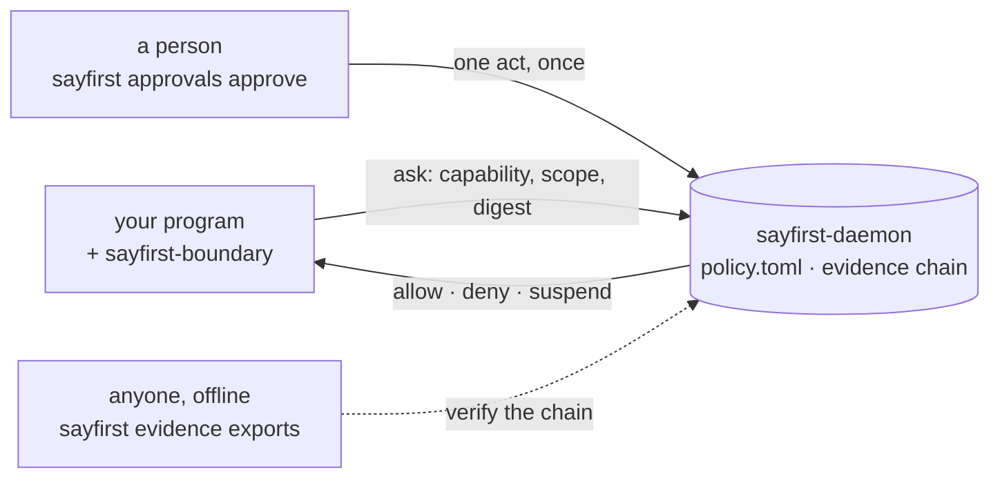

<!-- SPDX-License-Identifier: Apache-2.0 -->
# A governed agent

**SayFirst — ask before you act.**

This repository is the demonstrator: an ordinary LangGraph agent, governed end to end, so
you can watch the boundary hold rather than read that it does. **The model proposes. The
control plane decides** — and swapping the model changes nothing about the governance.

## The thirty-second tour

A governed program puts one question to a local control plane before it does anything that
matters: *may I do this, with these arguments, as this account?* The daemon answers one of
three things — **allow**, **deny**, **suspend** — out of a policy file a person can read,
over a Unix socket that learns who is asking from the kernel's own peer credential. No
token, no URL, nothing to leak.

A suspension is a wait for a person. One command answers it, once; the same question asked
again is then allowed — or denied, carrying the reason the person gave. Every decision
leaves a record in an evidence chain that names the act and never its content.



Three lines worth repeating:

1. **The program never decides.** It asks, and does only what was allowed — the boundary
   (`sayfirst-boundary`) holds the grant for one execution and at most one, because nothing
   copies a grant reference onto an artefact, into a file or across a process.
2. **A person is in the loop by construction, not by dashboard.** `sayfirst approvals
   approve` is one person's act, with nothing counting signatures; the deadline is in the
   policy; a rejection is final for as long as the wait is.
3. **The evidence is honest about itself.** A deployment of this version is graded
   **observability** — the governed program can write or replace the store, so the record is
   one that program could have forged — and neither proof nor tamper detection is claimed. An
   export of a still-open epoch verifies with coverage `unknown` rather than `complete`.

## What this demonstration shows

The agent is asked to review an internal research corpus, write a report, and send it to an
external partner. Four capabilities, four answers — set in **policy**, in a file, not in the
agent:

| Capability | Answer | What happens |
|---|---|---|
| `documents.read` | `allow` | executes |
| `report.write.internal` | `allow` | executes |
| `communications.send.external` | `suspend` | **the graph suspends, nothing is sent** |
| `data.upload.external` | `deny` | never executes |

That table is `demo-policy.toml`, in full, and editing it is how you change what the agent
is allowed to do. Reasoning is not authority: the tool body is not entered until a separate
process has answered.

The moment that matters: the model decides to send the report, and the run stops with
`Outbox messages: 0`. A person approves with one command. The graph resumes — and
**resuming grants nothing**: the node asks again, the control plane answers the wait it
already had, and exactly one message appears.

```
  GOVERNANCE: A PERSON MUST ANSWER
  Capability          communications.send.external
  Approval reference  <the reference the control plane minted>
  Graph state         SUSPENDED
  Outbox messages     0
  Side effect status  NOT EXECUTED
```

Four takes of the same graph, chosen by name: `hitl` (approve or reject), `allow` (nothing
suspends), `deny` (refused outright), `pending` (stops at the suspension, for the first half
of a recording). Six verdicts share five exit codes — `0` completed, `1` denied or rejected,
`3` refused, `4` could not ask, `5` suspended — the ones the product command also publishes.

### Eight claims, each one checked

```
The external side effect is behind the boundary.
A suspension happens before the side effect, not after it.
Resuming the graph does not itself grant authority.
The control plane remains the authority.
Denied and rejected acts do not execute.
An act fails closed when the control plane cannot be reached.
An approval is bound to the arguments of the act it approved.
Evidence names the act and never its content.
```

Seven are asserted by eight cases in `tests/e2e/test_governance_acceptance.py`, each driving
the real node wrapper, the real published boundary, the real published client and a real
daemon in its own process — including the substitution attack, which approves one recipient
and resumes with another. The eighth, failing closed, is asserted by
`tests/integration/test_fail_closed.py` with no control plane at all. One command runs the
lot, in about a minute of test time on the machine that wrote this. The model is faked in
those tests; **the governance is not**, and the assertion is almost always the same one: how
many artefacts are in the outbox.

What each claim means, and the longer list of what is *not* proven:
[`docs/SECURITY_PROPERTIES.md`](docs/SECURITY_PROPERTIES.md).

## Quickstart

| Distribution | What it is | Where it is |
|---|---|---|
| `sayfirst-contract==0.2.0` | the socket client the boundary speaks through | on the index |
| `sayfirst-boundary==0.2.0` | the boundary itself | on the index |
| `sayfirst-cli` | the command a person answers with | on the index |
| `sayfirst-control-plane==0.2.0` | the daemon this demonstration asks | publishing |

`uv tool install sayfirst-cli==0.2.0` gets you the command a person types — five minutes with
it on its own [`QUICKSTART.md`](https://github.com/fredaime/sayfirst-cli/blob/v0.2.0/QUICKSTART.md)
— and it is a dependency of nothing here. The daemon's distribution is not on the index yet,
so `./scripts/bootstrap.sh` builds every wheel it needs from a checkout of each public
repository, at the tag of the release this demonstration shows — two clones and one line:

```bash
git clone --branch v0.2.0 https://github.com/fredaime/sayfirst-control-plane
git clone --branch v0.2.0 https://github.com/fredaime/sayfirst-cli
SAYFIRST_CONTRACT_SOURCE=../sayfirst-control-plane SAYFIRST_CONTRACT_REF=v0.2.0 \
SAYFIRST_CLIENT_SOURCE=../sayfirst-cli SAYFIRST_CLIENT_REF=v0.2.0 \
  ./scripts/bootstrap.sh
```

The build reads an archive of that tag, never a checkout's loose files. Then, two terminals:

```bash
./scripts/bootstrap.sh                # the environment, a configuration file, directories
./scripts/start-control-plane.sh      # terminal 1 — the control plane, on a local socket
./scripts/check-demo.sh               # terminal 2 — every precondition, observed
./scripts/run-demo.sh hitl            # terminal 2 — run the agent
```

Green `MODEL` lines scroll, cyan `EXEC` lines confirm each allowed act ran, and the send
suspends on the frame above — printing the command that answers it, reference already in place:

```bash
sayfirst approvals show    --approval REF --scope local --socket /run/user/1000/sayfirst-demo/daemon.sock
sayfirst approvals approve --approval REF --scope local --socket /run/user/1000/sayfirst-demo/daemon.sock
```

`--reason` is optional and a recording is better for one. The graph resumes on its own:

```
HUMAN    operator approved the request  answer=approved
EXEC     send_external_email executed  recipient=partner@example.test

  EXECUTED  the run completed under authority

  Outbox artefacts: 1   (<your checkout>/runtime/outbox)
```

Answer `sayfirst approvals reject` instead and the outbox stays at `0` — arguably the
stronger clip. Then read what was recorded, side by side:

```bash
sayfirst evidence history --from 1 --scope local --socket /run/user/1000/sayfirst-demo/daemon.sock
cat runtime/outbox/*.json
```

The chain is one line per entry — sequence, kind, connection, hash — and a last line saying
where a reader would continue. The artefact beside it names the decision that authorised it:
the artefact carries the content, the chain none of it. Beat by beat, every frame pasted
from a real run: [`docs/DEMO_SCRIPT.md`](docs/DEMO_SCRIPT.md).

## The honest notes

**On a fresh clone the first take refuses, and that is the expected first outcome rather
than a fault.** It refuses for one of two reasons and says which: the distributions this is
built on are not installed, and it names the missing one and the two ways to get it; or no
model is named yet, and it ends saying which two settings to set.

**A model is opt-in.** The tests need none. To watch the agent reason, set
`MODEL_MODE=real` with `MODEL_BASE_URL` and `MODEL_NAME` pointing at any server that speaks
the OpenAI-compatible API and serves a tool-calling model. This project is independent. It
is not affiliated with, sponsored by, or endorsed by any model vendor, and no vendor's model
is required: a model is a configuration line here, which is the architectural point.

**The grade is observability, not proof.** The daemon these scripts start runs as the same
account as the agent, which can therefore write or replace the store. The grade above it is
defined and unreached by this version; all three are in the control plane's own
[`SECURITY.md`](https://github.com/fredaime/sayfirst-control-plane/blob/v0.2.0/SECURITY.md).

**A reduced gate is green and is not a pass.** `./scripts/gate.sh` exits `75` on a machine
that cannot build the open distributions: it names and counts every check it did not run and
proves nothing against a control plane. `0` is the full gate; anything else is a failure.

**What is not proven at all:** nothing here is formally verified; no regulatory conformity
is claimed; this governs tool execution at a node boundary and says nothing about prompt
injection or about what the model writes; and the pause is not durable — the graph
checkpoints in memory, so a suspension dies with the process while the approval outlives it.

## Architecture

| Repository | What it is | Distributions |
|---|---|---|
| [`sayfirst-control-plane`](https://github.com/fredaime/sayfirst-control-plane) | the daemon, the contract, the boundary, the policy format, the evidence chain | `sayfirst-contract`, `sayfirst-boundary`, the daemon, plus the stub and conformance kits |
| [`sayfirst-cli`](https://github.com/fredaime/sayfirst-cli) | the `sayfirst` command: ask, trace, explain, evidence, approvals, instrument, packs | `sayfirst-cli` |
| `sayfirst-governed-agent-demo` | this repository: a LangGraph agent governed end to end | none — it is cloned and run |

Inside this one, three things are kept apart and never collapsed: **observability** (what
did the agent do — the chain, metadata only), **governance** (was it permitted — the policy,
per capability) and **authority** (who could permit it — the control plane, and for a
suspended act a person; never the model, never the agent's own process).

The interception point is the **node registration**. `governed_node` wraps the callable a
node is registered with, so the decision lands after the framework has committed to the act
and before the body that causes it:

```python
builder.add_node(
    NODE_SEND_EXTERNAL,
    governed_node(
        CAP_COMMUNICATIONS_SEND_EXTERNAL, nodes[NODE_SEND_EXTERNAL], select=bind_send_external
    ),
)
```

Four such registrations, one capability key each, and `select=` projects the fields that
constitute the act — change a bound field and it is a different question, so a substituted
act gets a wait of its own rather than somebody else's approval.

The boundary is composed by hand, in one module, from the two published distributions: a
supported way to use it, and the only way to govern a node of a graph. The convenience packs
the command ships — `database`, `http-client`, `subprocess`, listed by `sayfirst packs list`
— wrap library calls, and none can name a node; `sayfirst instrument run` puts the boundary
in front of somebody else's code without changing it, for effects that *are* library calls.
Full detail: [`docs/ARCHITECTURE.md`](docs/ARCHITECTURE.md).

## The gate, the guards and contributing

`./scripts/gate.sh` is the whole gate — format, lint and every tier, against a control plane
it starts — and what it runs is what the workflow runs, bar the sign-off check. Beside the
behavioural tiers sit guards that read this tree's own files: that every published sentence
sends a reader somewhere they can go, that every address points at one of the three public
repositories, that the decided name is the only name declared, that every authored file
names its licence, and that the policy file still says what these documents say.
Contributions arrive under the Developer Certificate of Origin — `git commit -s` — and the
rest is in [CONTRIBUTING.md](CONTRIBUTING.md) and [SECURITY.md](SECURITY.md).

Nothing here arrived by copy from anywhere, and
[`docs/OPEN_SOURCE_READINESS.md`](docs/OPEN_SOURCE_READINESS.md) records every pin, what
this never depends on, and what must not be published.

## Status

**0.2.0**, the first public release, and one number said everywhere. What the next one
carries is written down already: the daemon's distribution on an index, which retires both
checkouts above and the gate's reduced mode with it
([`docs/publication-checklist.md`](docs/publication-checklist.md)), and the evidence grade,
which is the control plane's to reach. [CHANGELOG.md](CHANGELOG.md) has the rest.

## Licence

Apache-2.0 for this repository's own files; see [LICENSE](LICENSE) and [NOTICE](NOTICE). The
invented documents under `demo_data/` are `Apache-2.0 OR MIT-0`, so a reader may lift them
into a demonstration of their own. A model you point this at is covered by its own terms.
