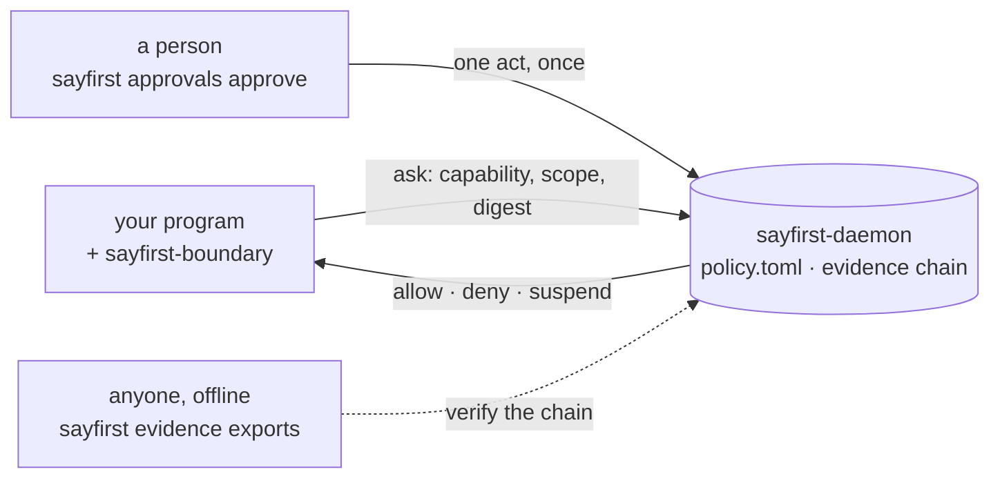

<!-- SPDX-License-Identifier: Apache-2.0 -->
# A governed agent

**SayFirst — ask before you act.**

This repository is the demonstrator: an ordinary LangGraph agent, governed end to end, so
you can watch the boundary hold rather than read that it does. **The model proposes. The
control plane decides** — and swapping the model changes nothing about the governance.

## The thirty-second tour

A governed program puts one question to a local control plane before it does anything that
matters: *may I do this, with these arguments, as this account?* The daemon answers one of
three things — **allow**, **deny**, **suspend** — out of a policy file a person can read,
over a Unix socket that learns who is asking from the kernel's own peer credential. No
token, no URL, nothing to leak.

A suspension is a wait for a person. One command answers it, once; the same question asked
again is then allowed — or denied, carrying the reason the person gave. Every decision
leaves a record in an evidence chain that names the act and never its content.


```mermaid
flowchart LR
    P[your program<br/>+ sayfirst-boundary] -- "ask: capability, scope, digest" --> D[(sayfirst-daemon<br/>policy.toml · evidence chain)]
    D -- "allow · deny · suspend" --> P
    H[a person<br/>sayfirst approvals approve] -- "one act, once" --> D
    V[anyone, offline<br/>sayfirst evidence exports] -. "verify the chain" .-> D
```

Three lines worth repeating:

1. **The program never decides.** It asks, and does only what was allowed — the boundary
   (`sayfirst-boundary`) holds the grant for one execution and at most one, because nothing
   copies a grant reference onto an artefact, into a file or across a process.
2. **A person is in the loop by construction, not by dashboard.** `sayfirst approvals
   approve` is one person's act, with nothing counting signatures; the deadline is in the
   policy; a rejection is final for as long as the wait is.
3. **The evidence is honest about itself.** A deployment of this version is graded
   **observability** — the governed program can write or replace the store, so the record is
   one that program could have forged — and neither proof nor tamper detection is claimed. An
   export of a still-open epoch verifies with coverage `unknown` rather than `complete`.

## What this demonstration shows

The agent is asked to review an internal research corpus, write a report, and send it to an
external partner. Four capabilities, four answers — set in **policy**, in a file, not in the
agent:

| Capability | Answer | What happens |
|---|---|---|
| `documents.read` | `allow` | executes |
| `report.write.internal` | `allow` | executes |
| `communications.send.external` | `suspend` | **the graph suspends, nothing is sent** |
| `data.upload.external` | `deny` | never executes |

That table is `demo-policy.toml`, in full, and editing it is how you change what the agent
is allowed to do. Reasoning is not authority: the tool body is not entered until a separate
process has answered.

The moment that matters: the model decides to send the report, and the run stops with
`Outbox messages: 0`. A person approves with one command. The graph resumes — and
**resuming grants nothing**: the node asks again, the control plane answers the wait it
already had, and exactly one message appears.

```
  GOVERNANCE: A PERSON MUST ANSWER
  Capability          communications.send.external
  Approval reference  REF
  Graph state         SUSPENDED
  Outbox messages     0
  Side effect status  NOT EXECUTED
```

Four takes of the same graph, chosen by name: `hitl` (approve or reject), `allow` (nothing
suspends), `deny` (refused outright), `pending` (stops at the suspension, for the first half
of a recording). Six verdicts share five exit codes — `0` completed, `1` denied or rejected,
`3` refused, `4` could not ask (nothing listening when a take starts, or the control plane
unreachable when a node asks), `5` suspended — the ones the product command also publishes.
A take already waiting for a person keeps waiting if the control plane stops, then ends
suspended (`5`) when its wait ends, five minutes by default, with nothing sent. `7` is a
precondition or a configuration the scripts refuse before any take starts, and `2` a usage
error: a take name the program does not know. `./scripts/run-demo.sh` with no take name
runs `hitl`.

### Eight claims, each one checked

```
The external side effect is behind the boundary.
A suspension happens before the side effect, not after it.
Resuming the graph does not itself grant authority.
The control plane remains the authority.
Denied and rejected acts do not execute.
An act fails closed when the control plane cannot be reached.
An approval is bound to the arguments of the act it approved.
Evidence names the act and never its content.
```

Seven are asserted by eight cases in `tests/e2e/test_governance_acceptance.py`, each driving
the real node wrapper, the real published boundary, the real published client and a real
daemon in its own process — including the substitution attack, which approves one recipient
and resumes with another. The eighth, failing closed, is asserted by
`tests/integration/test_fail_closed.py` with no control plane at all. One command runs the
lot, in about a minute of test time on the machine that wrote this. The model is faked in
those tests; **the governance is not**, and the assertion is almost always the same one: how
many artefacts are in the outbox.

What each claim means, and the longer list of what is *not* proven:
[`docs/SECURITY_PROPERTIES.md`](docs/SECURITY_PROPERTIES.md).

## Quickstart

Everything it needs is on the Python index at 0.3.2: the contract, the boundary and the
control plane this demonstration runs on, and the command a person answers with. No model
is needed — the default mode plays a scripted transcript — and the governance is real
either way.

You need `git` and `uv` (https://docs.astral.sh/uv/); the bootstrap refuses without `uv`
(exit `7`) and installs everything else itself.

```bash
git clone https://github.com/fredaime/sayfirst-governed-agent-demo
cd sayfirst-governed-agent-demo
./scripts/bootstrap.sh                # the environment, a configuration file, directories
uv tool install sayfirst-cli==0.3.2   # the command a person answers with
```

Then three terminals, all in the checkout:

```bash
./scripts/start-control-plane.sh      # terminal 1 — the control plane, on a local socket
./scripts/check-demo.sh               # terminal 2 — every precondition, observed
./scripts/run-demo.sh hitl            # terminal 2 — run the agent
```

Green `MODEL` lines scroll, cyan `EXEC` lines confirm each allowed act ran, and the send
suspends, printing the three commands that answer it with the reference and the socket
already in place — pasted from a run, with each reference written `REF` for the approval and
`DECISION_REF` for a decision, because each is a fresh value on every take:

```
00:55:21  MODEL    tool selected: send_external_email  capability=communications.send.external
00:55:21  EVIDENCE the boundary recorded an outcome  sequence=1  capability=documents.read  decision=DECISION_REF  outcome=sha256:dd80e5b8ceca25f0e5e823387afaa5c3fa4b2006cadaba5fb18fab261866e1fd  dropped_before=0
00:55:21  EVIDENCE the boundary recorded an outcome  sequence=2  capability=report.write.internal  decision=DECISION_REF  outcome=sha256:70dcf6c02429181513dde39d32244075403280ea62edfb6fd5c9904ec10822f6  dropped_before=0

  GOVERNANCE: A PERSON MUST ANSWER
  Capability          communications.send.external
  Approval reference  REF
  Graph state         SUSPENDED
  Outbox messages     0
  Side effect status  NOT EXECUTED

  Answer it, in another terminal:
    sayfirst approvals show --approval REF --scope local --socket /run/user/1000/sayfirst-demo/daemon.sock
    sayfirst approvals approve --approval REF --scope local --socket /run/user/1000/sayfirst-demo/daemon.sock
    sayfirst approvals reject --approval REF --scope local --socket /run/user/1000/sayfirst-demo/daemon.sock
  Resuming grants nothing: the node asks again and the control plane answers.
```

Answer in terminal 3 with the `approve` line exactly as printed; the graph resumes on its
own:

```
00:55:35  HUMAN    operator approved the request  answer=approved
00:55:35  EXEC     send_external_email executed  recipient=partner@example.test
00:55:35  MODEL    scripted transcript, no model (MODEL_MODE=fixture) proposes  turn=12
00:55:35  MODEL    model produced a final answer, no tool requested
00:55:35  EVIDENCE the boundary recorded an outcome  sequence=3  capability=communications.send.external  decision=DECISION_REF  outcome=sha256:cf93dec1b23cbcb867ffbe77456cf907d159396094c9ff7e5e6558018fbdfdbb  dropped_before=0

  EXECUTED  the run completed under authority

  Outbox artefacts: 1   (<your checkout>/runtime/outbox)
```

The run then prints the agent's answer and where its events and the chain are kept.
`reject` instead leaves the outbox as it was.

Then read what was recorded, side by side (use the socket the take's last line prints) —
`DECISION_REF` below stands for the artefact's own `decision_ref`:

```bash
sayfirst evidence history --from 1 --scope local --socket /run/user/1000/sayfirst-demo/daemon.sock
cat runtime/outbox/*.json
sayfirst trace --scope local --decision DECISION_REF --socket /run/user/1000/sayfirst-demo/daemon.sock
```

The artefact names the decision that authorised it (`decision_ref`); `trace` follows that
decision into the chain. The artefact carries the content, the chain none of it. Beat by
beat, every frame pasted from a real run: [`docs/DEMO_SCRIPT.md`](docs/DEMO_SCRIPT.md).

Between takes, `./scripts/reset-demo.sh` stops the control plane and removes its run
directory — its decisions, approvals, evidence, socket and configuration — and clears the
outbox; it starts nothing. Start the control plane again in terminal 1
(`./scripts/start-control-plane.sh`) before the next take. A reset also clears the answers
already given: a second take without it shows the first take's message still in the outbox,
and meets the first take's answers — after a rejected `hitl`, a `pending` take does not
suspend but ends `REJECTED` (exit `1`), for as long as the rejected wait lasts.

**A model, opt-in.** In `.env`: `MODEL_MODE=real`, `MODEL_BASE_URL` and `MODEL_NAME`, pointing
at any server that speaks the OpenAI-compatible API and serves a tool-calling model — a
local one included. The takes and the answers are the same; the model's wording is its own.

**From checkouts instead** (contributors): clone `sayfirst-control-plane` and `sayfirst-cli`
beside this checkout at the tag, and name them — to the bootstrap and to the gate alike:

```bash
git clone --branch v0.3.2 https://github.com/fredaime/sayfirst-control-plane ../sayfirst-control-plane
git clone --branch v0.3.2 https://github.com/fredaime/sayfirst-cli ../sayfirst-cli
export SAYFIRST_CONTRACT_SOURCE=../sayfirst-control-plane SAYFIRST_CONTRACT_REF=v0.3.2
export SAYFIRST_CLIENT_SOURCE=../sayfirst-cli SAYFIRST_CLIENT_REF=v0.3.2
./scripts/bootstrap.sh && ./scripts/gate.sh
```

## The honest notes

**On a fresh clone every script that starts, checks or runs the demonstration refuses until
the bootstrap has run** (`7`, naming the script to run).

**A model is opt-in.** The tests need none and neither does a take: fixture mode plays a
scripted transcript. To watch the agent reason, set `MODEL_MODE=real` with `MODEL_BASE_URL`
and `MODEL_NAME` pointing at any server that speaks the OpenAI-compatible API and serves a
tool-calling model. This project is independent. It
is not affiliated with, sponsored by, or endorsed by any model vendor, and no vendor's model
is required: a model is a configuration line here, which is the architectural point.

**The grade is observability, not proof.** The daemon these scripts start runs as the same
account as the agent, which can therefore write or replace the store. The grade above it is
defined and unreached by this version; all three are in the control plane's own
[`SECURITY.md`](https://github.com/fredaime/sayfirst-control-plane/blob/v0.3.2/SECURITY.md).

**A reduced gate is green and is not a pass.** `./scripts/gate.sh` exits `75` on a machine
that cannot obtain the open distributions — with no checkout named it installs from the
index; `SAYFIRST_INDEX=no`, with no checkout named, forces the reduced run. It names and counts every check it did
not run and proves nothing against a control plane. `0` is the full gate; anything else is a
failure.

**What is not proven at all:** nothing here is formally verified; no regulatory conformity
is claimed; this governs tool execution at a node boundary and says nothing about prompt
injection or about what the model writes; and the pause is not durable — the graph
checkpoints in memory, so a suspension dies with the process while the approval outlives it.

## Architecture

| Repository | What it is | Distributions |
|---|---|---|
| [`sayfirst-control-plane`](https://github.com/fredaime/sayfirst-control-plane) | the daemon, the contract, the boundary, the policy format, the evidence chain | `sayfirst-contract`, `sayfirst-boundary`, the daemon, plus the stub and conformance kits |
| [`sayfirst-cli`](https://github.com/fredaime/sayfirst-cli) | the `sayfirst` command: ask, trace, explain, evidence, approvals, instrument, packs | `sayfirst-cli` |
| `sayfirst-governed-agent-demo` | this repository: a LangGraph agent governed end to end | none — it is cloned and run |

Inside this one, three things are kept apart and never collapsed: **observability** (what
did the agent do — the chain, metadata only), **governance** (was it permitted — the policy,
per capability) and **authority** (who could permit it — the control plane, and for a
suspended act a person; never the model, never the agent's own process).

The interception point is the **node registration**. `governed_node` wraps the callable a
node is registered with, so the decision lands after the framework has committed to the act
and before the body that causes it:

```python
builder.add_node(
    NODE_SEND_EXTERNAL,
    governed_node(
        CAP_COMMUNICATIONS_SEND_EXTERNAL, nodes[NODE_SEND_EXTERNAL], select=bind_send_external
    ),
)
```

Four such registrations, one capability key each, and `select=` projects the fields that
constitute the act — change a bound field and it is a different question, so a substituted
act gets a wait of its own rather than somebody else's approval.

The boundary is composed by hand, in one module, from the two published distributions: a
supported way to use it, and the only way to govern a node of a graph. The convenience packs
the command ships — `database`, `http-client`, `subprocess`, listed by `sayfirst packs list`
— wrap library calls, and none can name a node; `sayfirst instrument run` puts the boundary
in front of somebody else's code without changing it, for effects that *are* library calls.
Full detail: [`docs/ARCHITECTURE.md`](docs/ARCHITECTURE.md).

## The gate, the guards and contributing

`./scripts/gate.sh` is the whole gate — format, lint and every tier, against a control plane
it starts — and what it runs is what the workflow runs, bar the sign-off check. Beside the
behavioural tiers sit guards that read this tree's own files: that every published sentence
sends a reader somewhere they can go, that every address under this project's account points
at one of its three public repositories, that the decided name is the only name declared, that every authored file
names its licence, and that the policy file still says what these documents say.
Contributions arrive under the Developer Certificate of Origin — `git commit -s` — and the
rest is in [CONTRIBUTING.md](CONTRIBUTING.md) and [SECURITY.md](SECURITY.md).

Nothing here arrived by copy from anywhere, and
[`docs/OPEN_SOURCE_READINESS.md`](docs/OPEN_SOURCE_READINESS.md) records every pin, what
this never depends on, and what must not be published.

## Status

**0.3.2**, and one number said everywhere. The daemon's distribution is on the index, and so
are the two this demonstration imports; the evidence grade is the control plane's to reach.
[CHANGELOG.md](CHANGELOG.md) has the rest.

## Licence

Apache-2.0 for this repository's own files; see [LICENSE](LICENSE) and [NOTICE](NOTICE). The
invented documents under `demo_data/` are `Apache-2.0 OR MIT-0`, so a reader may lift them
into a demonstration of their own. A model you point this at is covered by its own terms.
